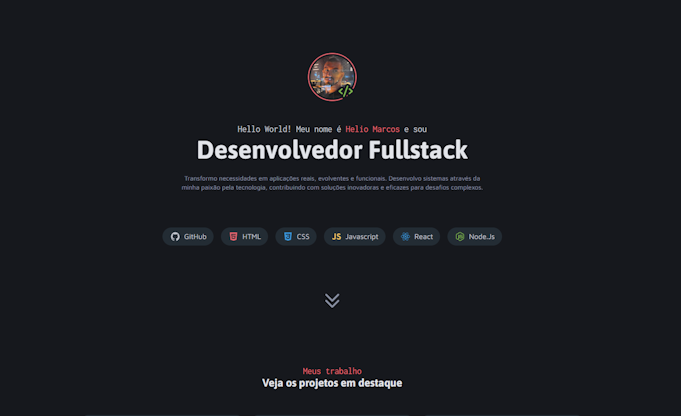

<h1 align="center" style="font-weight: bold;">Dev Portifolio 🤓</h1>

<p align="center">
 <a href="#tech">Technologies</a> • 
 <a href="#started">Getting Started</a> • 
  <a href="#colab">Collaborators</a> •
 <a href="#contribute">Contribute</a>
</p>

<p align="center">
    <b>Dev portifolio webpage for application of knowledge in html/css</b>
    
</p>
<p align="center">
    It'll be updated with further knowledge acquired. 😊
</p>
<p align="center">
     <a href="https://hmajr.github.io/05_Portifolio-Dev/">📱 Visit this Project</a>
</p>

<h2 id="layout">🎨 Layout</h2>

<p align="center">
    
</p>

<h2 id="technologies">💻 Technologies</h2>

- HTML
- CSS
- (more tech soon...)

<h2 id="started">🚀 Getting started</h2>

Open index.html from some web browser
Branch structure:
- MAIN : lastest knowledge
- HTML : HTML/CSS only version
- React : soon...
...

I think is great to visualize the knowledge evolution 🤓

<h3>Prerequisites</h3>

No prerequisites! (for a while)

<h3>Cloning</h3>

How to clone your project

```bash
git clone https://github.com/hmajr/05_Portifolio-Dev
```

<h3>Starting</h3>

How to start your project

```bash
cd 05_Portifolio-Dev
```

<h2 id="colab">🤝 Collaborators</h2>

Special thank for Rocketseat - Fullstack 

<h3>Documentations that might help</h3>

[📝 How to create a Pull Request](https://www.atlassian.com/br/git/tutorials/making-a-pull-request)

[💾 Commit pattern](https://gist.github.com/joshbuchea/6f47e86d2510bce28f8e7f42ae84c716)

